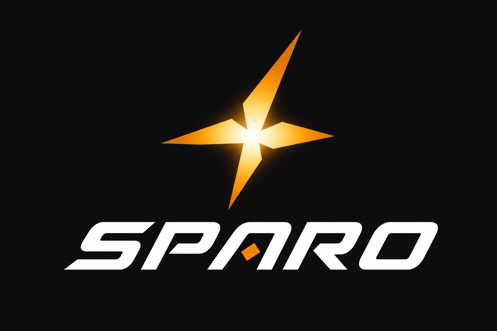

# Sparo Agent Browser

<p align="center">
  
</p>

**Sparo Agent Browser**  
**The browser built for AI agents — humans stay in control.**

**Sparo 人机同窗浏览器**  
**AI 驾驭网页，你驾驭 AI**

> **99% AI · 1% human.** Agents do the work. People set goals and review.  
> **AI 做 99%，人做 1%。** Agent 干活，人定目标、做审核。

---

## The problem · 要解决什么

Traditional browsers were designed for **human hands**: mouse, tabs, bookmarks, extensions.  
传统浏览器是为**人手**设计的：鼠标、标签页、书签、插件。

That design **limits AI**. Agents are forced to pretend to be humans — fragile scripts, cloud remote desktops, or “browser tools” detached from what you actually see. Collaboration breaks: you don’t trust what the AI did, and the AI can’t reliably share your session.  
这套形态**限制了 AI**。Agent 只能假装成人：脆弱脚本、云端远控，或和你眼前页面脱节的「浏览器工具」。协作断裂——你不信任 AI 做了什么，AI 也无法稳定共用你的会话。

**Sparo Agent Browser explores a different form:** one real Chromium window, shared by human and agent. The agent is first-class. The human stays in control.  
**Sparo 人机同窗浏览器探索另一种形态：** 一个真实 Chromium 窗口，人与 Agent 共用。Agent 是一等公民，人始终握有控制权。

---

## Why Sparo Agent Browser · 为什么值得体验

| # | English | 中文 |
|---|---|---|
| 1 | **AI–human co-browser** — same pixels, same cookies, same truth | **人机同窗协作** — 同一画面、同一登录态、同一事实 |
| 2 | **99 / 1 division of labor** — agent executes; you approve the 1% that matters | **99/1 分工** — Agent 执行；你只审那关键的 1% |
| 3 | **Any agent welcome** — OpenClaw, Hermes, Workbuddy, Codex, Cursor… via MCP | **兼容任意 AI Agent** — 经 MCP 接入，不绑死一家模型 |
| 4 | **Agent-first, human-acceptable** — automation without abandoning a real browser | **更适合 AI，人类也接受** — 不是抛弃浏览器，而是重做协作方式 |
| 5 | **Build on top** — open local shell; vertical packs (e.g. commerce listing) can plug in later | **可继续开发** — 本地可扩展；电商上架等垂直能力可模块化叠加 |

If you believe **browsers made only for humans are holding AI back**, Sparo Agent Browser is the experiment you should try.  
若你也认为**只为人设计的浏览器正在拖慢 AI**，Sparo 人机同窗浏览器就是值得上手的一次探索。

---

## What’s unique · 独创点

### Original thinking · 理念

We treat the browser as **collaboration infrastructure for agents**, not a human UI with automation bolted on.  
我们把浏览器当成 **Agent 的协作基础设施**，而不是「给人用的壳 + 外挂自动化」。

Most stacks pick one extreme: either a normal Chrome you drive awkwardly, or a headless/cloud browser the human never truly shares. Sparo insists on **both**: agent-native control **and** a window a person can watch, pause, and take over.  
多数方案走极端：要么是人手 Chrome 勉强被驱动，要么是人类看不懂的无头/云端浏览器。Sparo 坚持**两者兼得**：Agent 原生操控 + 人可围观、可暂停、可接管的窗口。

### Original (and practical) technology · 技术独创与落地

| Capability · 能力 | Why it matters · 为何不同 |
|---|---|
| **Shared Chromium + MCP actuator** | One process is both the UI and the tool surface — no “remote desktop for bots” tax | 同一进程既是界面也是工具面，省掉远控式 Bot 成本 |
| **Trusted input path** | Clicks/fills go through real input events the page believes — critical for modern React / Ant Design UIs | 真实输入事件，现代前端不再“点了没反应” |
| **Confirm-after-act** | `navigate` returns verified URL/title; agents must not claim success on the wrong host | 动作后校验，禁止假成功 |
| **Pause / Approval as first-class** | Human-in-the-loop is protocol, not an afterthought | 暂停与审批是产品协议，不是事后补丁 |
| **Agent onboarding contract** | `AGENTS.md` + `sparo_info` + `npm run open` — agents start in seconds, not by reading the whole repo | Agent 30 秒上手，而不是通读仓库 |
| **BYO brain** | Sparo is the hands; your model/agent is the brain — DeepSeek, OpenAI-compatible, or any MCP agent | 手脑分离，模型与 Agent 可换 |

---

## Core features · 核心功能

1. **Goal-driven browsing** — say what you want; built-in chat or external agent operates the page.  
   **目标驱动浏览** — 说目标；内置对话或外部 Agent 操作页面。  
2. **MCP browser API** — `navigate` / `snapshot` / `click` / `fill` / tabs / pause / approval…  
   **MCP 浏览器 API** — 导航、快照、点击、填写、标签、暂停、审批…  
   See [MCP API Reference](./docs/MCP-API.md) for all tools and parameters.  
   详见 [MCP API 参考](./docs/MCP-API.md)。  
   **Publishing / 发小红书:** [PUBLISHING.md](./docs/PUBLISHING.md) — AI detects stage; scripts inject content once.  
   **发帖指南：** [PUBLISHING.md](./docs/PUBLISHING.md) — AI 认阶段，脚本一次投递标题/正文。  
3. **Multi-agent compatibility** — plug OpenClaw / Hermes / Workbuddy / Codex / your own loop.  
   **多 Agent 兼容** — 龙虾、Hermes、Workbuddy、Codex 或自研循环皆可。  
4. **Human override** — Pause freezes the agent; Approval gates risky submits.  
   **人类否决权** — 暂停即停手；高风险提交先审批。  
5. **Skills (teach once)** — record a flow, or use inject skills (`run_skill` / `xhs_inject_*`).  
   **妙招（教一遍）** — 录制复用；发布优先脚本投递。见 [`strategies/skills/README.md`](./strategies/skills/README.md)。  
6. **Local & private** — runs on your machine; API keys stay local; never shipped in the repo.  
   **本地私有** — 本机运行；密钥不进仓库。  
7. **Extensible platform** — general automation today; optional vertical modules (e.g. e-commerce auto-listing) tomorrow.  
   **可扩展平台** — 今天通用自动化；明天可选垂直模块（如电商自动上架）。

---

## Quick start · 快速开始

**For AI agents · 给 AI Agent：** read [`AGENTS.md`](./AGENTS.md) first (30s), then:

```bash
npm run status
npm run open -- https://weibo.com
```

**For humans · 给人：**

```bash
npm install   # first time only · 仅首次
npm run start
```

1. Sidebar → **Model** → paste your API Key → Save.  
   侧栏 → **Model** → 填入 API Key → 保存。  
2. Chat a goal, e.g. `打开微博` / `open github.com`.  
   对话里说目标。  
3. Or connect an external agent via MCP.  
   或经 MCP 连接外部 Agent。

Optional env (local only · 仅本机)：

```bash
$env:SPARO_PROVIDER="deepseek"   # deepseek | openai | custom
$env:SPARO_API_KEY="your-key"
$env:SPARO_MODEL="deepseek-v4-flash"
$env:SPARO_BASE_URL="https://api.deepseek.com"
```

**Model setup tip · 模型配置说明：**  
A key alone is not enough. Choose **Brand** first (DeepSeek default → V4 Flash).  
OpenAI / custom keys must use their own **Base URL** — pasting a GPT key into DeepSeek’s host will fail.  
只填 Key 不够。先选 **Brand**（默认 DeepSeek → V4 Flash）。  
OpenAI / 自定义 Key 必须配对应 **Base URL**——把 GPT Key 打到 DeepSeek 服务器会失败。

Settings · 配置：`%APPDATA%\sparo\settings.json`（gitignored）

---

## Use with any AI agent · 对接任意 Agent

Sparo is the **hands**. Your agent is the **brain**.  
Sparo 是「手」。你的 Agent 是「脑」。

1. `npm run start` — keep Sparo running.  
2. Read `%APPDATA%\sparo\mcp-auth.json` (`endpoint` + `token`).  
3. Register Sparo as MCP in OpenClaw / Hermes / Workbuddy / Codex / Cursor / Claude Code.  
4. Give the agent a goal; use **Pause** when you want the mouse back.  

See · 详见 [`docs/AGENTS.md`](./docs/AGENTS.md) · [`docs/PUBLISHING.md`](./docs/PUBLISHING.md) · [`docs/MCP-API.md`](./docs/MCP-API.md) · [`docs/ARCHITECTURE.md`](./docs/ARCHITECTURE.md)

### MCP tools · 工具（节选）

`sparo_info` · `navigate` · `get_url` · `snapshot` · `click` · `fill` · `click_text` · `pause` · `resume` · `request_approval` · `wait_for` · tabs · skills  

Default · 默认：`http://127.0.0.1:3920/mcp`  
Full list · 完整列表：[MCP API Reference](./docs/MCP-API.md)

---

## Roadmap · 路线图

| Now · 当前 | Next · 近期 | Later · 后续 |
|---|---|---|
| Agent–human co-browser + MCP + BYO model/agent | Faster agent onboarding, skill replay, multi-model UX | Optional **e-commerce auto-listing** packs |
| 人机同窗 + MCP + 自备模型/Agent | Agent 更快上手、妙招回放、多模型体验 | 可选 **电商自动上架** 模块 |

Partnerships (listing automation, agent integrations, commercial licensing): GitHub Issue / Discussion.  
合作（上架自动化、Agent 对接、商业授权）：请提 Issue / Discussion。

---

## License · 许可

**Personal, non-commercial use only.** See [`LICENSE`](./LICENSE).  
**仅限私人非商用。** 详见 [`LICENSE`](./LICENSE)。

Commercial use requires a separate agreement.  
商用需另行授权。


---

**南方星火 · SouthernSpark**  
📧 walter.x@qq.com  
🔗 [github.com/southernspark-nfxh](https://github.com/southernspark-nfxh)  
📕 小红书：**南方星火 SouthernSpark**  

*AI-powered storytelling & agent tools. 开源 AI Agent 技能包 & 浏览器自动化工具箱.*
